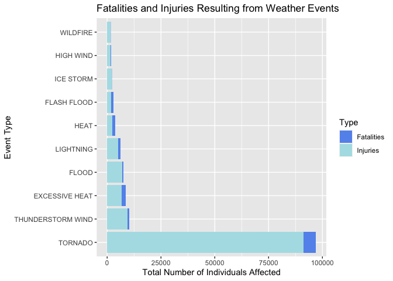
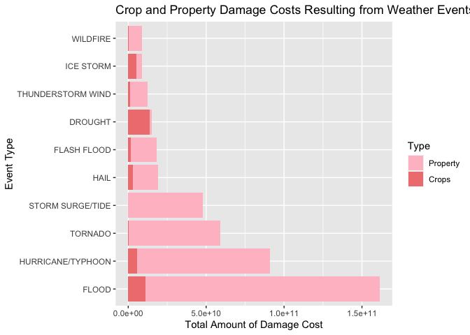

## Introduction:

Storms and other severe weather events can cause both public health and economic problems for communities and municipalities. Many severe events can result in fatalities, injuries, and property damage, and preventing such outcomes to the extent possible is a key concern. This project involves exploring the U.S. National Oceanic and Atmospheric Administration's (NOAA) storm database. This database tracks characteristics of major storms and weather events in the United States, including when and where they occur, as well as estimates of any fatalities, injuries, and property damage.

## Synopsis:

The analysis on the data from the U.S. National Oceanic and Atmospheric Administration's (NOAA) storm database revealed that tornadoes are the most harmful in terms of public health. The total injuries and fatalities produced by tornadoes in the database far exceeded other weather/storm events and had the greatest overall health impact. In terms of monetary damage and loss, analysis on the data showed that floods are by far the most costly event, affecting both property and crops and resulting in the largest economic impact.

## Data Processing:

# First Step: Loading necessary libraries:


```r
#load libraries
library(plyr)
```

```
## Warning: package 'plyr' was built under R version 4.0.2
```

```r
library(ggplot2)
library(dplyr)
```

```
## 
## Attaching package: 'dplyr'
```

```
## The following objects are masked from 'package:plyr':
## 
##     arrange, count, desc, failwith, id, mutate, rename, summarise,
##     summarize
```

```
## The following objects are masked from 'package:stats':
## 
##     filter, lag
```

```
## The following objects are masked from 'package:base':
## 
##     intersect, setdiff, setequal, union
```

```r
library(data.table)
```

```
## 
## Attaching package: 'data.table'
```

```
## The following objects are masked from 'package:dplyr':
## 
##     between, first, last
```

# Next, read in/load the data:


```r
#First, read in the data
url <- "https://d396qusza40orc.cloudfront.net/repdata%2Fdata%2FStormData.csv.bz2"
download.file(url, "StormData.csv.bz2")
library(R.utils)
```

```
## Warning: package 'R.utils' was built under R version 4.0.2
```

```
## Loading required package: R.oo
```

```
## Warning: package 'R.oo' was built under R version 4.0.2
```

```
## Loading required package: R.methodsS3
```

```
## Warning: package 'R.methodsS3' was built under R version 4.0.2
```

```
## R.methodsS3 v1.8.0 (2020-02-14 07:10:20 UTC) successfully loaded. See ?R.methodsS3 for help.
```

```
## R.oo v1.23.0 successfully loaded. See ?R.oo for help.
```

```
## 
## Attaching package: 'R.oo'
```

```
## The following object is masked from 'package:R.methodsS3':
## 
##     throw
```

```
## The following objects are masked from 'package:methods':
## 
##     getClasses, getMethods
```

```
## The following objects are masked from 'package:base':
## 
##     attach, detach, load, save
```

```
## R.utils v2.9.2 successfully loaded. See ?R.utils for help.
```

```
## 
## Attaching package: 'R.utils'
```

```
## The following object is masked from 'package:utils':
## 
##     timestamp
```

```
## The following objects are masked from 'package:base':
## 
##     cat, commandArgs, getOption, inherits, isOpen, nullfile, parse,
##     warnings
```

```r
bunzip2("StormData.csv.bz2", "StormData.csv")
storm_raw_data <- read.csv("StormData.csv")
```

# Examine the data:


```r
dim(storm_raw_data)
```

```
## [1] 902297     37
```

```r
head(storm_raw_data)
```

```
##   STATE__           BGN_DATE BGN_TIME TIME_ZONE COUNTY COUNTYNAME STATE  EVTYPE
## 1       1  4/18/1950 0:00:00     0130       CST     97     MOBILE    AL TORNADO
## 2       1  4/18/1950 0:00:00     0145       CST      3    BALDWIN    AL TORNADO
## 3       1  2/20/1951 0:00:00     1600       CST     57    FAYETTE    AL TORNADO
## 4       1   6/8/1951 0:00:00     0900       CST     89    MADISON    AL TORNADO
## 5       1 11/15/1951 0:00:00     1500       CST     43    CULLMAN    AL TORNADO
## 6       1 11/15/1951 0:00:00     2000       CST     77 LAUDERDALE    AL TORNADO
##   BGN_RANGE BGN_AZI BGN_LOCATI END_DATE END_TIME COUNTY_END COUNTYENDN
## 1         0                                               0         NA
## 2         0                                               0         NA
## 3         0                                               0         NA
## 4         0                                               0         NA
## 5         0                                               0         NA
## 6         0                                               0         NA
##   END_RANGE END_AZI END_LOCATI LENGTH WIDTH F MAG FATALITIES INJURIES PROPDMG
## 1         0                      14.0   100 3   0          0       15    25.0
## 2         0                       2.0   150 2   0          0        0     2.5
## 3         0                       0.1   123 2   0          0        2    25.0
## 4         0                       0.0   100 2   0          0        2     2.5
## 5         0                       0.0   150 2   0          0        2     2.5
## 6         0                       1.5   177 2   0          0        6     2.5
##   PROPDMGEXP CROPDMG CROPDMGEXP WFO STATEOFFIC ZONENAMES LATITUDE LONGITUDE
## 1          K       0                                         3040      8812
## 2          K       0                                         3042      8755
## 3          K       0                                         3340      8742
## 4          K       0                                         3458      8626
## 5          K       0                                         3412      8642
## 6          K       0                                         3450      8748
##   LATITUDE_E LONGITUDE_ REMARKS REFNUM
## 1       3051       8806              1
## 2          0          0              2
## 3          0          0              3
## 4          0          0              4
## 5          0          0              5
## 6          0          0              6
```

```r
str(storm_raw_data)
```

```
## 'data.frame':	902297 obs. of  37 variables:
##  $ STATE__   : num  1 1 1 1 1 1 1 1 1 1 ...
##  $ BGN_DATE  : chr  "4/18/1950 0:00:00" "4/18/1950 0:00:00" "2/20/1951 0:00:00" "6/8/1951 0:00:00" ...
##  $ BGN_TIME  : chr  "0130" "0145" "1600" "0900" ...
##  $ TIME_ZONE : chr  "CST" "CST" "CST" "CST" ...
##  $ COUNTY    : num  97 3 57 89 43 77 9 123 125 57 ...
##  $ COUNTYNAME: chr  "MOBILE" "BALDWIN" "FAYETTE" "MADISON" ...
##  $ STATE     : chr  "AL" "AL" "AL" "AL" ...
##  $ EVTYPE    : chr  "TORNADO" "TORNADO" "TORNADO" "TORNADO" ...
##  $ BGN_RANGE : num  0 0 0 0 0 0 0 0 0 0 ...
##  $ BGN_AZI   : chr  "" "" "" "" ...
##  $ BGN_LOCATI: chr  "" "" "" "" ...
##  $ END_DATE  : chr  "" "" "" "" ...
##  $ END_TIME  : chr  "" "" "" "" ...
##  $ COUNTY_END: num  0 0 0 0 0 0 0 0 0 0 ...
##  $ COUNTYENDN: logi  NA NA NA NA NA NA ...
##  $ END_RANGE : num  0 0 0 0 0 0 0 0 0 0 ...
##  $ END_AZI   : chr  "" "" "" "" ...
##  $ END_LOCATI: chr  "" "" "" "" ...
##  $ LENGTH    : num  14 2 0.1 0 0 1.5 1.5 0 3.3 2.3 ...
##  $ WIDTH     : num  100 150 123 100 150 177 33 33 100 100 ...
##  $ F         : int  3 2 2 2 2 2 2 1 3 3 ...
##  $ MAG       : num  0 0 0 0 0 0 0 0 0 0 ...
##  $ FATALITIES: num  0 0 0 0 0 0 0 0 1 0 ...
##  $ INJURIES  : num  15 0 2 2 2 6 1 0 14 0 ...
##  $ PROPDMG   : num  25 2.5 25 2.5 2.5 2.5 2.5 2.5 25 25 ...
##  $ PROPDMGEXP: chr  "K" "K" "K" "K" ...
##  $ CROPDMG   : num  0 0 0 0 0 0 0 0 0 0 ...
##  $ CROPDMGEXP: chr  "" "" "" "" ...
##  $ WFO       : chr  "" "" "" "" ...
##  $ STATEOFFIC: chr  "" "" "" "" ...
##  $ ZONENAMES : chr  "" "" "" "" ...
##  $ LATITUDE  : num  3040 3042 3340 3458 3412 ...
##  $ LONGITUDE : num  8812 8755 8742 8626 8642 ...
##  $ LATITUDE_E: num  3051 0 0 0 0 ...
##  $ LONGITUDE_: num  8806 0 0 0 0 ...
##  $ REMARKS   : chr  "" "" "" "" ...
##  $ REFNUM    : num  1 2 3 4 5 6 7 8 9 10 ...
```

# Clean and Process the Data:
It appears there are many differnt columns, so we want to select the specific ones we need for analysis.


```r
#Data Cleaning
#Interested in these 7 variables, do not need other columns in data set
fields<-c("EVTYPE","FATALITIES","INJURIES","PROPDMG", "PROPDMGEXP","CROPDMG","CROPDMGEXP")
working_data<-storm_raw_data[fields]
```

We want to remove any rows where all the info we are looking for is 0. As we are looking at events with the larget impact, these rows are not beneficial to keep.


```r
#Remove data where every relevant column is 0
working_data <- working_data %>% filter(INJURIES !=0 | FATALITIES !=0 | PROPDMG !=0 | CROPDMG !=0)
```

We also see that many evennt names are similar, and that there are typos. So, we will try to group mislabelled events for better analysis (although it would take forever to get every instance of mislabelling, we will try and curb the majority):


```r
#Correct the storm types 
working_data_corrected <- working_data
working_data_corrected$EVTYPE <- toupper(working_data_corrected$EVTYPE)
working_data_corrected$EVTYPE <- gsub("^(SMALL )?HAIL.*", "HAIL", working_data_corrected$EVTYPE)
working_data_corrected$EVTYPE <- gsub("TSTM|THUNDERSTORMS?", "THUNDERSTORM", working_data_corrected$EVTYPE)
working_data_corrected$EVTYPE <- gsub("STORMS?", "STORM", working_data_corrected$EVTYPE)
working_data_corrected$EVTYPE <- gsub("WINDS?|WINDS?/HAIL", "WIND", working_data_corrected$EVTYPE)
working_data_corrected$EVTYPE <- gsub("RAINS?", "RAIN", working_data_corrected$EVTYPE)
working_data_corrected$EVTYPE <- gsub("^TH?UN?DEE?RS?TO?RO?M ?WIND.*|^(SEVERE )?THUNDERSTORM$|^WIND STORM$|^(DRY )?MI[CR][CR]OBURST.*|^THUNDERSTORMW$", "THUNDERSTORM WIND", working_data_corrected$EVTYPE)
working_data_corrected$EVTYPE <- gsub("^COASTAL ?STORM$|^MARINE ACCIDENT$", "MARINE THUNDERSTORM WIND", working_data_corrected$EVTYPE)
working_data_corrected$EVTYPE <- gsub("^FLOODS?.*|^URBAN/SML STREAM FLD$|^(RIVER|TIDAL|MAJOR|URBAN|MINOR|ICE JAM|RIVER AND STREAM|URBAN/SMALL STREAM)? FLOOD(ING)?S?$|^HIGH WATER$|^URBAN AND SMALL STREAM FLOODIN$|^DROWNING$|^DAM BREAK$", "FLOOD", working_data_corrected$EVTYPE)
working_data_corrected$EVTYPE <- gsub("^FLASH FLOOD.*|^RAPIDLY RISING WATER$", "FLASH FLOOD", working_data_corrected$EVTYPE)
working_data_corrected$EVTYPE <- gsub("WATERSPOUTS?", "WATERSPOUT", working_data_corrected$EVTYPE)
working_data_corrected$EVTYPE <- gsub("WEATHER/MIX", "WEATHER", working_data_corrected$EVTYPE)
working_data_corrected$EVTYPE <- gsub("CURRENTS?", "CURRENT", working_data_corrected$EVTYPE)
working_data_corrected$EVTYPE <- gsub("^WINDCHILL$|^COLD.*|^LOW TEMPERATURE$|^UNSEASONABLY COLD$", "COLD/WIND CHILL", working_data_corrected$EVTYPE)
working_data_corrected$EVTYPE <- gsub("^EXTREME WIND ?CHILL$|^(EXTENDED|EXTREME|RECORD)? COLDS?$", "EXTREME COLD/WIND CHILL", working_data_corrected$EVTYPE)
working_data_corrected$EVTYPE <- gsub("^WILD/FOREST FIRE$|^(WILD|BRUSH|FOREST)? ?FIRES?$", "WILDFIRE", working_data_corrected$EVTYPE)
working_data_corrected$EVTYPE <- gsub("^RAIN/SNOW$|^(BLOWING|HEAVY|EXCESSIVE|BLOWING|ICE AND|RECORD)? ?SNOWS?.*", "HEAVY SNOW", working_data_corrected$EVTYPE)
working_data_corrected$EVTYPE <- gsub("^FOG$", "DENSE FOG", working_data_corrected$EVTYPE)
working_data_corrected$EVTYPE <- gsub("^(GUSTY|NON-SEVERE|NON ?-?THUNDERSTORM)? ?WIND.*|^ICE/STRONG WIND$", "STRONG WIND", working_data_corrected$EVTYPE)
working_data_corrected$EVTYPE <- gsub("SURGE$", "SURGE/TIDE", working_data_corrected$EVTYPE)
working_data_corrected$EVTYPE <- gsub("CLOUDS?", "CLOUD", working_data_corrected$EVTYPE)
working_data_corrected$EVTYPE <- gsub("^FROST[/\\]FREEZE$|^FROST$|^(DAMAGING)? ?FREEZE$|^HYP[OE]R?THERMIA.*|^ICE$|^(ICY|ICE) ROADS$|^BLACK ICE$|^ICE ON ROAD$", "FROST/FREEZE", working_data_corrected$EVTYPE)
working_data_corrected$EVTYPE <- gsub("^GLAZE.*|^FREEZING (RAIN|DRIZZLE|RAIN/SNOW|SPRAY$)$|^WINTRY MIX$|^MIXED PRECIP(ITATION)?$|^WINTER WEATHER MIX$|^LIGHT SNOW$|^FALLING SNOW/ICE$|^SLEET.*", "SLEET", working_data_corrected$EVTYPE)
working_data_corrected$EVTYPE <- gsub("^HURRICANE.*", "HURRICANE/TYPHOON", working_data_corrected$EVTYPE)
working_data_corrected$EVTYPE <- gsub("^HEAT WAVES?$|^UNSEASONABLY WARM$|^WARM WEATHER$", "HEAT", working_data_corrected$EVTYPE)
working_data_corrected$EVTYPE <- gsub("^(EXTREME|RECORD/EXCESSIVE|RECORD) HEAT$", "EXCESSIVE HEAT", working_data_corrected$EVTYPE)
working_data_corrected$EVTYPE <- gsub("^HEAVY SURF(/HIGH SURF)?.*$|^(ROUGH|HEAVY) SEAS?.*|^(ROUGH|ROGUE|HAZARDOUS) SURF.*|^HIGH WIND AND SEAS$|^HIGH SURF.*", "HIGH SURF", working_data_corrected$EVTYPE)
working_data_corrected$EVTYPE <- gsub("^LAND(SLUMP|SLIDE)?S?$|^MUD ?SLIDES?$|^AVALANCH?E$", "AVALANCHE", working_data_corrected$EVTYPE)
working_data_corrected$EVTYPE <- gsub("^UNSEASONABLY WARM AND DRY$|^DROUGHT.*|^HEAT WAVE DROUGHT$", "DROUGHT", working_data_corrected$EVTYPE)
working_data_corrected$EVTYPE <- gsub("^TORNADO.*", "TORNADO", working_data_corrected$EVTYPE)
working_data_corrected$EVTYPE <- gsub("^TROPICAL STORM.*", "TROPICAL STORM", working_data_corrected$EVTYPE)
working_data_corrected$EVTYPE <- gsub("^MARINE MISHAP$|^HIGH WIND/SEAS$", "MARINE HIGH WIND", working_data_corrected$EVTYPE)
working_data_corrected$EVTYPE <- gsub("^HIGH WIND.*", "HIGH WIND", working_data_corrected$EVTYPE)
working_data_corrected$EVTYPE <- gsub("^HIGH SEAS$", "MARINE STRONG WIND", working_data_corrected$EVTYPE)
working_data_corrected$EVTYPE <- gsub("^RIP CURRENT.*", "RIP CURRENT", working_data_corrected$EVTYPE)
working_data_corrected$EVTYPE <- gsub("^WATERSPOUT.*", "WATERSPOUT", working_data_corrected$EVTYPE)
working_data_corrected$EVTYPE <- gsub("^EXCESSIVE RAINFALL$|^RAIN.*|^TORRENTIAL RAINFALL$|^(HEAVY|HVY)? (RAIN|MIX|PRECIPITATION).*", "HEAVY RAIN", working_data_corrected$EVTYPE)
working_data_corrected$EVTYPE <- gsub("^FOG.*", "FREEZING FOG", working_data_corrected$EVTYPE)
working_data_corrected$EVTYPE <- gsub("^WINTER STORM.*", "WINTER STORM", working_data_corrected$EVTYPE)
working_data_corrected$EVTYPE <- gsub("^THUNDERSNOW$|^ICE STORM.*", "ICE STORM", working_data_corrected$EVTYPE)
working_data_corrected$EVTYPE <- gsub("WAVES?|SWELLS?", "SURF", working_data_corrected$EVTYPE)
working_data_corrected$EVTYPE <- gsub("^LIGHTNING.*", "LIGHTNING", working_data_corrected$EVTYPE)
working_data_corrected$EVTYPE <- gsub("^WHIRLWIND$|^GUSTNADO$|^TORNDAO$", "TORNADO", working_data_corrected$EVTYPE)
working_data_corrected$EVTYPE <- gsub("^COASTAL FLOOD.*", "COASTAL FLOOD", working_data_corrected$EVTYPE)
working_data_corrected$EVTYPE <- gsub("^TYPHOON", "HURRICANE/TYPHOON", working_data_corrected$EVTYPE)
working_data_corrected$EVTYPE <- gsub("^EROSION/CSTL FLOOD$|^COASTAL FLOOD/EROSION$|^COASTAL SURGE/TIDE$", "COASTAL FLOOD", working_data_corrected$EVTYPE)
working_data_corrected$EVTYPE <- gsub("^ASTRONOMICAL HIGH TIDE$", "STORM SURGE/TIDE", working_data_corrected$EVTYPE)
working_data_corrected$EVTYPE <- gsub("^(GROUND)? ?BLIZZARD.*$", "BLIZZARD", working_data_corrected$EVTYPE)
working_data_corrected$EVTYPE <- gsub("^DUST STORM.*$", "DUST STORM", working_data_corrected$EVTYPE)
```

## Results:

# Processing The Data: The question we want to answer:

## 1. Across the United States, which types of events (as indicated in the EVTYPE variable) are most harmful with respect to population health?

Simplifying data - not necessary, but allows analysis and processing of data to be clearer:


```r
#Remove cost columns to simplify, not required for health analysis
health_total <- subset(working_data_corrected, select = -c(CROPDMGEXP, PROPDMGEXP, CROPDMG, PROPDMG))

#Changing column names for aesthetics
colnames(health_total)[colnames(health_total) == "EVTYPE"] <- "Event"
colnames(health_total)[colnames(health_total) == "FATALITIES"] <- "Fatalities"
colnames(health_total)[colnames(health_total) == "INJURIES"] <- "Injuries"
```

Aggregate the data for better analysis, and store in two seperate data frames. This will allow us to merge the two data frames and sum both totals together.


```r
#aggregate all fatalities together
f <- aggregate(health_total$Fatalities, by = list(Event = health_total$Event), FUN = sum)
colnames(f) <- c("Event", "Fatalities")

#aggregate all injuries together
i <- aggregate(health_total$Injuries, by = list(Event = health_total$Event), FUN = sum)
colnames(i) <- c("Event", "Injuries")
```

Merge the two data frames, and create a column for the total of the fatalities and injuries added together. This total column will help us order the data and find the most overall harmful events.


```r
#merge the two dataframes
health <- merge(f,i, by="Event")

#add total column
health$Total_Health <- health$Fatalities + health$Injuries
```

Select the top ten events eith the largest impact, as we are looking for the most harmful events:


```r
#order dataframe by total value
people_total <- health[order(-health$Total_Health), ][1:10, ]
```

Now, we want to plot our data. We melt the type column, so each event is recorded by injuries and fatalities. This allows us to make them distinct in the bar plot.


```r
#HEALTH PLOT
#Create plot of health data
#Melt so it is easier to put in a graph
health_plot_data <- melt(people_total, id.vars = "Event", variable.name = "Type")
```

```
## Warning in melt(people_total, id.vars = "Event", variable.name = "Type"):
## The melt generic in data.table has been passed a data.frame and will attempt
## to redirect to the relevant reshape2 method; please note that reshape2 is
## deprecated, and this redirection is now deprecated as well. To continue using
## melt methods from reshape2 while both libraries are attached, e.g. melt.list,
## you can prepend the namespace like reshape2::melt(people_total). In the next
## version, this warning will become an error.
```

```r
#remove last 10 rows as they are sum for total, no longer needed - was needed only to order the data
n<-dim(health_plot_data)[1]
health_chart <-health_plot_data[1:(n-10),]
```

Create the plot:


```r
#create plot
g <- ggplot(health_chart, aes(x=reorder(Event, -value), y = value)) + geom_bar(stat="identity", aes(fill = Type)) +  scale_fill_manual(values=c("#6495ED", "#B0E0E6"))
g + coord_flip() + xlab("Event Type") + ylab("Total Number of Individuals Affected") + ggtitle("Fatalities and Injuries Resulting from Weather Events")
```

<!-- -->

In this plot, we are able to see that tornadoes have the gratest impact on healt, with a high amount of both fatalities and injuries.


# Processing The Data: The question we want to answer:

## 2. Across the United States, which types of events have the greatest economic consequences?

We want to convert the exponents from letters, and then multiply their respective damage column by the resulting number. This allows us to accurately see the cost of each event.


```r
#ECONOMY
#fix/merge the values from the exponential columns
damage_total <- working_data_corrected %>% 
        mutate(CROPDMG = ifelse(CROPDMGEXP == "K", CROPDMG * 1000, CROPDMG), CROPDMG = ifelse(CROPDMGEXP == "M", CROPDMG * 1000000, CROPDMG), CROPDMG = ifelse(CROPDMGEXP == "B", CROPDMG * 1000000000, CROPDMG)) %>%
        mutate(PROPDMG = ifelse(PROPDMGEXP == "K", PROPDMG * 1000, PROPDMG), PROPDMG = ifelse(PROPDMGEXP == "M", PROPDMG * 1000000, PROPDMG), PROPDMG = ifelse(PROPDMGEXP == "B", PROPDMG * 1000000000, PROPDMG))
```

Simplifying data - not necessary, but allows analysis and processing of data to be clearer:


```r
#Remove exponent and health columns for damage dataset, no longer relevant
damage_total <- subset(damage_total, select = -c(CROPDMGEXP, PROPDMGEXP, FATALITIES, INJURIES))

#Changing column names for aesthetics
colnames(damage_total)[colnames(damage_total) == "EVTYPE"] <- "Event"
colnames(damage_total)[colnames(damage_total) == "PROPDMG"] <- "Property"
colnames(damage_total)[colnames(damage_total) == "CROPDMG"] <- "Crops"
```

Aggregate the data for better analysis, and store in two seperate data frames. This will allow us to merge the two data frames and sum both totals together.


```r
#aggregate all property costs together
p <- aggregate(damage_total$Property, by = list(Event = damage_total$Event), FUN = sum)
colnames(p) <- c("Event", "Property")

#aggregate all crops costs together
c <- aggregate(damage_total$Crops, by = list(Event = damage_total$Event), FUN = sum)
colnames(c) <- c("Event", "Crops")
```

Merge the two data frames, and create a column for the total of the property and crop damage added together. This total column will help us order the data and find the most overall harmful events.


```r
#merge the two dataframes
total <- merge(p,c, by="Event")

#add total column
total$Total_Damage <- total$Property + total$Crops
```

Select the top ten events eith the largest impact, as we are looking for the most harmful events:


```r
#order dataframe by total damage
econ_total <- total[order(-total$Total_Damage), ][1:10, ]
```

Now, we want to plot our data. We melt the type column, so each event is recorded by property damage and crop damage. This allows us to make them distinct in the bar plot.


```r
#Economic PLOT
#Create plot of health data
#Melt so it is easier to put in a graph
economic_plot_data <- melt(econ_total, id.vars = "Event", variable.name = "Type")
```

```
## Warning in melt(econ_total, id.vars = "Event", variable.name = "Type"): The melt
## generic in data.table has been passed a data.frame and will attempt to redirect
## to the relevant reshape2 method; please note that reshape2 is deprecated, and
## this redirection is now deprecated as well. To continue using melt methods from
## reshape2 while both libraries are attached, e.g. melt.list, you can prepend the
## namespace like reshape2::melt(econ_total). In the next version, this warning
## will become an error.
```

```r
#remove last 10 rows as they are sum for total
n<-dim(economic_plot_data)[1]
economic_chart <-economic_plot_data[1:(n-10),]
```

Create the plot:


```r
#create plot
g <- ggplot(economic_chart, aes(x=reorder(Event, -value), y = value)) + geom_bar(stat="identity", aes(fill = Type)) +  scale_fill_manual(values=c("#FFC0CB", "#F08080"))
g + coord_flip() + xlab("Event Type") + ylab("Total Amount of Damage Cost") + ggtitle("Crop and Property Damage Costs Resulting from Weather Events")
```

<!-- -->

In the plot, we are able to see that floods are by far the event that has caused the greatest economic impact. 


The end!
